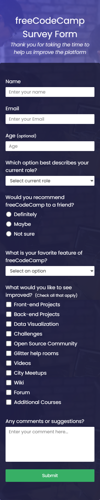
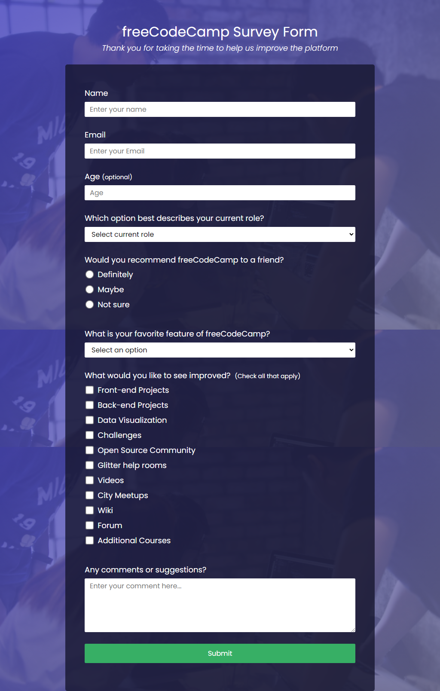
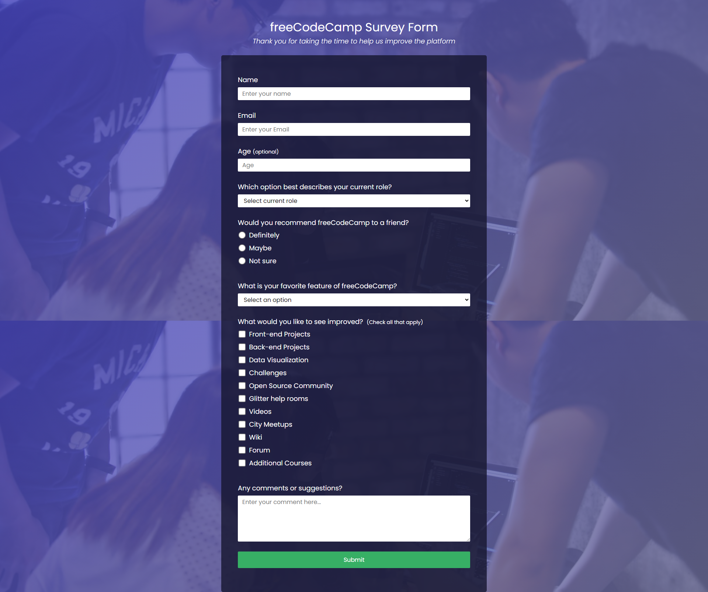

# Kolehiyolo | freeCodeCamp | Build a Survey Form
Welcome! I am a budding coder and this is my submission to the 'Build a Survey Form' project from freeCodeCamp.

## Table of contents
- [Overview](#overview)
  - [Summary](#summary)
  - [The Challenge](#the-challenge)
  - [Screenshots](#screenshots)
  - [Links](#links)
- [My Process](#my-process)
  - [Built With](#built-with)
  - [What I Learned](#what-i-learned)
  - [Continued Development](#continued-development)
  - [Useful Resources](#useful-resources)
- [Author](#author)
- [Acknowledgments](#acknowledgments)

## Overview
### Summary
It's been a while since I actually built this project but I do remember having fun with this since the design is actually quite good aesthetic-wise. It's a solid project that also forces me to really get into forms and inputs and all that. Overall this project was really exciting

### The Challenge
- Perfectly mimic the sample page from [CodePen](https://codepen.io/freeCodeCamp/full/VPaoNP)
- Make sure to follow the user stories dictated by freeCodeCamp
- Build it while ensuring accessibility and responsive-ness

### Screenshots

  
  
  

### Links
- freeCodeCamp Challenge: [freeCodeCamp | Build a Survey Form](https://www.freecodecamp.org/learn/responsive-web-design/responsive-web-design-projects/build-a-survey-form)
- Sample: [CodePen](https://codepen.io/freeCodeCamp/full/VPaoNP)
- Solution URL: [GitHub Repo](https://github.com/kolehiyolo/freecodecamp--build_a_survey_form)
- Live Site URL (Static): [Kolehiyolo | freeCodeCamp | Build a Survey Form (Static)](https://kolehiyolo.github.io/freecodecamp--build_a_survey_form/)
- Live Site URL: [Kolehiyolo | freeCodeCamp | Build a Survey Form](https://kolehiyolo.github.io/freecodecamp--build_a_survey_form/)

## My process
### Built with
- HTML5
- CSS5
- SASS
- Mobile-first workflow

### What I learned
One of the significant things I learned was setting up a background image and making it work position/zoom-wise. I built this project long ago so I'm not sure what else I had a hard time with or what new stuff I learned. Perhaps I'll update this document if I remember

### Continued development
I'm not sure what skills I picked up here that offer great help with my future projects, but I do enjoy learning more about building forms through practice. I guess if there's anything I can carry later is that practice really does build skills.

### Useful resources
- [WhatTheFont!](https://www.myfonts.com/WhatTheFont/) - This is a stellar tool for getting the actual fonts used in any image, or at least fonts that are similar.

## Author
- Website - [Add your name here](https://www.your-site.com)
- Frontend Mentor - [@kolehiyolo | Frontend Mentor](https://www.frontendmentor.io/profile/kolehiyolo)
- LinkedIn - [@Tristan Sean Paul Cinco | LinkedIn](https://www.linkedin.com/in/tristan-sean-paul-cinco-8685061a1/)
- GitHub - [@kolehiyolo | Github](https://github.com/kolehiyolo)
- YouTube - [@Tristan Sean Paul Cinco | YouTube](https://www.youtube.com/channel/UCeQfdvq83XLp-eS4vbZZN8Q)
- Facebook - [@Tristan Sean Paul Cinco | Facebook](https://www.facebook.com/tristanseanpaul.cinco.39/)
- Twitter - [@kolehiyolo1221 | Twitter](https://twitter.com/kolehiyolo1221)
- Instagram - [@kolehiyolo | Instagram](https://www.twitter.com/yourusername)

## Acknowledgments
Not really anything or anyone to thank. I'm just happy to be building projects.